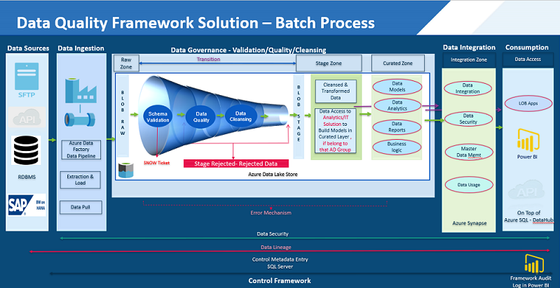
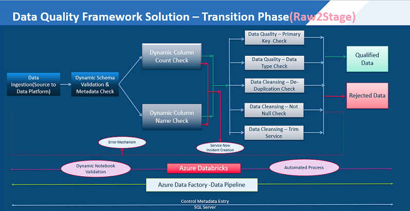
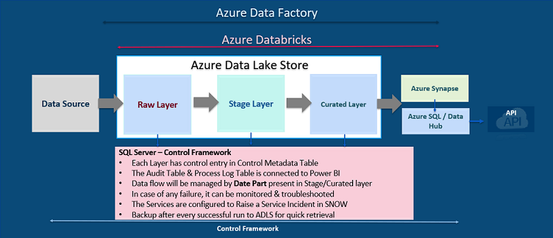
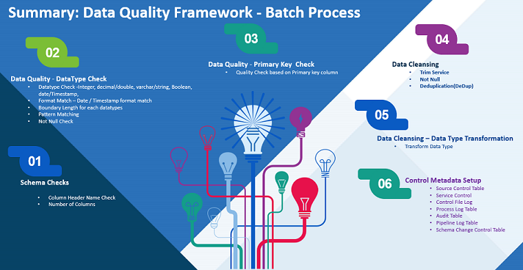

# DIDQ Batch Process

## Batch Flow

DIDQ has batch process in order to load data in batches into delta/Syanpase/Cache tables as per the defined schedule. Below is the pictorial representation of the end-to-end flow:

Below diagram describes about the complete flow of data from source till stage layer using ADF pipelines, Databricks notebooks.

- At the initial step, data ingested from any given source goes through schema and column-level validation.
- If both validations are passed, the data is finally makes it's way to the raw layer. If it fails, a servicenow incident is raised and error is logged in the logging tables.
- For the raw data transition to stage layer, it has undergo defined data quality checks which includes trim service, primary key validation, datatype vaildation, not null check, etc. If the data qualifies all checks, record is moved to the stage tables otherwise failed record is moved to stage rejected table along with logging error in the log tables.

- Complete batch flow consists of 3 delta layers in ADLS (Raw, Stage, Curated). Data coming from source is copied to ADLS location and then it is moved to Raw, stage, curated, synapse and finally to the cache layer
- Each Layer has control entry in Control Metadata Table
- The Audit Table & Process Log Table is connected to Power BI
- Data flow will be managed by Date Part present in Stage/Curated layer
- In case of any failure, it can be monitored & troubleshooted
- The Services are configured to Raise a Service Incident in SNOW

This diagram summarizes the complete batch process by listing all services and table details.

