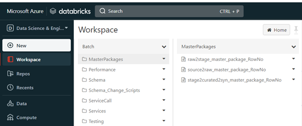
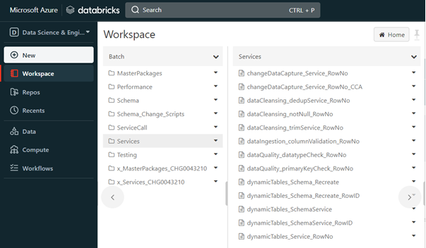
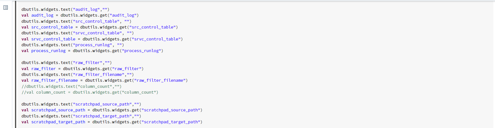
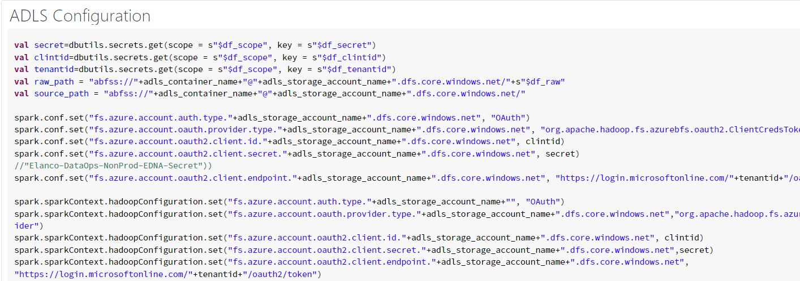
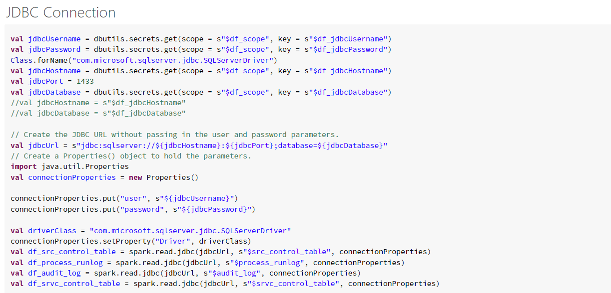
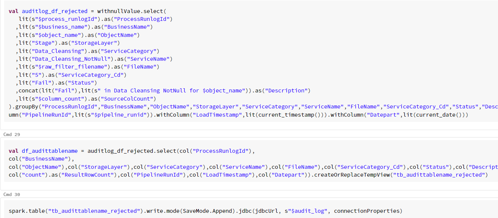

# Databricks ETL Framework

DIDQ Framework uses Databricks notebooks to perform data validation and data quality checks. Databricks ETL flow ensures that the required checks are in place whenever a file/data ingested to the system and these checks are executed in the given order. This flow consists of master packages(notebooks) which are calling data validation and data quality services. For each layer, there are separate packages and the respective services are called inside that notebook.
Below are the package names and their respective services:

## Services

**source2raw_master_package**  

- [dataIngestion_columnValidation](https://developer.elanco.com/dataops/data-ingestion-and-data-quality/3-services/service-column-validation)

**raw2stage_master_package**  

-	[dataCleansing_trimService](https://developer.elanco.com/dataops/data-ingestion-and-data-quality/3-services/service-trim)
-	[dataQuality_datatypeCheck](https://developer.elanco.com/dataops/data-ingestion-and-data-quality/3-services/service-datatype-validation)
-	[dataQuality_primaryKeyCheck](https://developer.elanco.com/dataops/data-ingestion-and-data-quality/3-services/service-primary-key)
-	[dataCleansing_notNull](https://developer.elanco.com/dataops/data-ingestion-and-data-quality/3-services/service-not-null)
-	[dataCleansing_dedupService](https://developer.elanco.com/dataops/data-ingestion-and-data-quality/3-services/service-deduplication)

**All services start from the initial trim service. It is mandatory to begin with trim service.**

If the data does not pass through any of the data quality checks, that record is sent to stage rejected table with the reason for failure in errormapcol.

## Databricks Notebook Flow

All databricks notebooks follows generic steps except the main functionality. Below are the major steps:

-	Initial step is setting up varibale values from the parameters passed and importing the required libraries.

-	Configuring Azure Data Lake Storage locations.

-	Establishing Database connection.

-	Code for speficic service functionality.

-	Sending entries to log tables.

