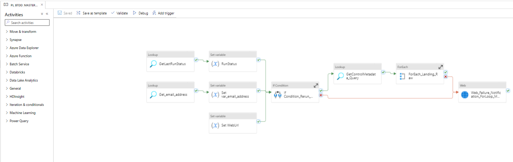
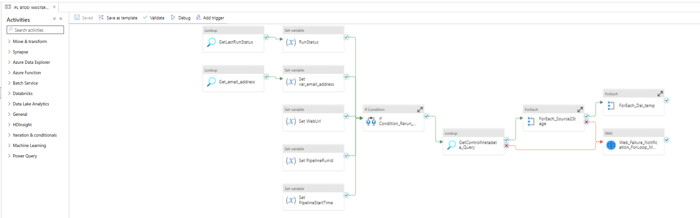
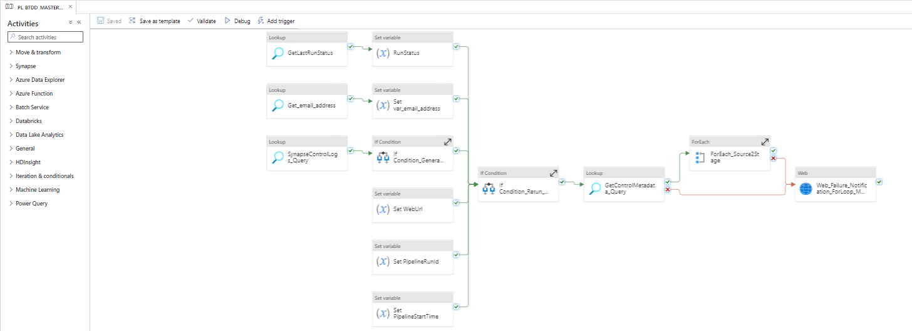
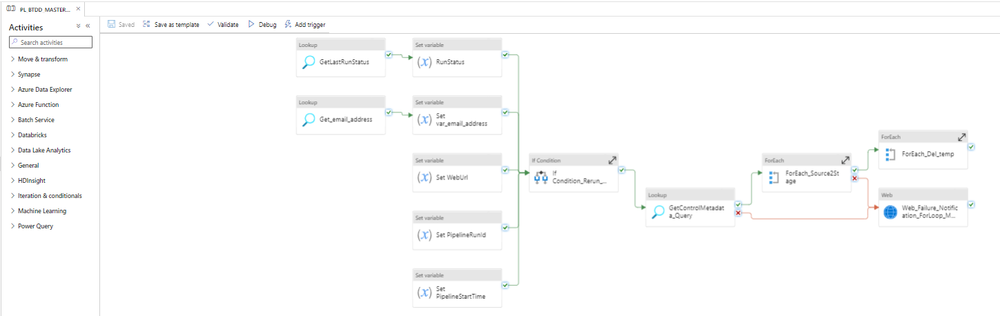
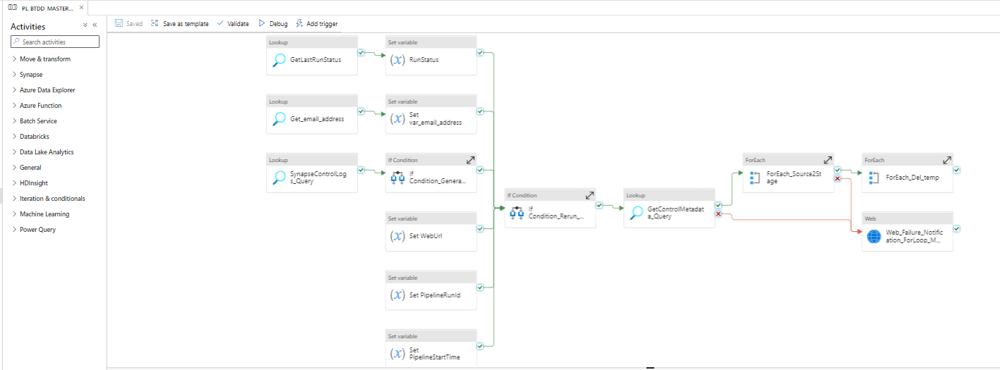

# Azure Data Factory ETL Framework

Data Integration Data Quality (DIDQ) framework is an essential component of data management. DIDQ ensures that the data is accurate, complete, and consistent, which is vital for making informed business decisions. One of the primary steps in DIDQ is Extract, Transform, and Load (ETL) processes, where data is extracted from various sources, transformed to fit the desired format, and loaded into a data warehouse.

To facilitate the ETL process in the DIDQ framework, we use Azure Data Factory (ADF). ADF is a cloud-based data integration service that enables us to create, schedule, and manage data pipelines to move and transform data from various sources. It allows us to process and transform data using Spark, Hive, and other big data technologies.

ADF offers various features to streamline the ETL process in the DIDQ framework. First, ADF supports connectivity to over 90 on-premises and cloud data sources, such as SQL Server, Oracle, MongoDB, and Amazon S3. Second, ADF provides a code-free user interface that enables us to create, deploy, and manage ETL pipelines visually. Third, ADF offers built-in transformation activities, such as data aggregation, filtering, and data masking.

In conclusion, ADF is a powerful tool for ETL processes in the DIDQ framework. With its cloud-based infrastructure, code-free user interface, and support for data quality and data governance, ADF streamlines the ETL process and ensures that the data is accurate, complete, and consistent.

## Source To Raw Pipeline

The Source to Raw pipeline in Azure Data Factory (ADF) is a crucial component of the Extract, Transform, Load (ETL) process. It involves copying data from the source folder of an object to the raw source folder and simultaneously creating an entry of that file in the control metadata table.

## Raw To Stage Pipeline

The Raw to Stage pipeline in Azure Data Factory (ADF) is an important component of the Extract, Transform, Load (ETL) process. It involves invoking a notebook activity to perform column validation in Databricks and load the Raw data into a raw delta table. Post passing the previous notebook activity, the pipeline then invokes another notebook activity to perform data quality checks in Databricks and load the data quality passed data in a stage delta table. This pipeline ensures that the data is validated, processed, and stored efficiently in the Stage Table.

## Stage To Curated Pipeline

The Stage to Curated pipeline in Azure Data Factory (ADF) is a crucial component of the Extract, Transform, Load (ETL) process. It involves invoking a notebook activity that performs Change Data Capture (CDC) of the data and applies various business logics to it. The pipeline then loads the final data into a curated delta table. This pipeline ensures that the data is efficiently transformed and stored in the Curated delta table.

## Curated To Synapse Pipeline

The Curated to Synapse pipeline in Azure Data Factory (ADF) is the business layer loading of the Extract, Transform, Load (ETL) process. It involves taking the data from the curated delta table and loading it into Azure SQL Pools. This pipeline ensures that the curated data is efficiently moved to the designated analytics environment for further analysis and insights.

## Synapse To Cache Pipeline

The Curated to Synapse pipeline in Azure Data Factory (ADF) involves taking the data from Azure SQL Pools, and loading it into Azure SQL Databases.

