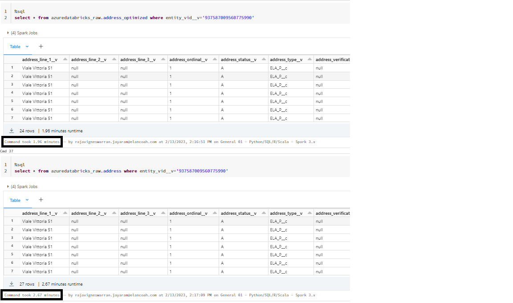

# Auto optimize on Azure Databricks

Auto optimize is an optional set of features that automatically compact small files during individual writes to a Delta table. Auto optimize adds latency overhead to write operations but accelerates read operations. Auto optimize is particularly useful in the following scenarios:

* Streaming use cases where latency in the order of minutes is acceptable
* MERGE INTO is the preferred method of writing into Delta Lake
* CREATE TABLE AS SELECT or INSERT INTO are commonly used operations

## How auto optimize works

Auto optimize consists of two complementary features: optimized writes and auto compaction.

## How optimized writes work

Azure Databricks dynamically optimizes Apache Spark partition sizes based on the actual data, and attempts to write out 128 MB files for each table partition. This is an approximate size and can vary depending on dataset characteristics.


## How auto compaction works

After an individual write, Azure Databricks checks if files can further be compacted, and runs an OPTIMIZE job (with 128 MB file sizes instead of the 1 GB file size used in the standard OPTIMIZE) to further compact files for partitions that have the most number of small files.

## Enable auto optimize

Optimized writes are enabled by default for the following operations in Databricks Runtime 9.1 LTS and above:

MERGE
UPDATE with subqueries
DELETE with subqueries
For other operations, or for Databricks Runtime 7.3 LTS, you can explicitly enable optimized writes and auto compaction using one of the following methods:

* New table: Set the table properties delta.autoOptimize.optimizeWrite = true and delta.autoOptimize.autoCompact = true in the CREATE TABLE command.

```md
CREATE TABLE student (id INT, name STRING, age INT) TBLPROPERTIES (delta.autoOptimize.optimizeWrite = true, delta.autoOptimize.autoCompact = true)
```

* Existing tables: Set the table properties delta.autoOptimize.optimizeWrite = true and delta.autoOptimize.autoCompact = true in the ALTER TABLE command.

```md
ALTER TABLE [table_name | delta.`<table-path>`] SET TBLPROPERTIES (delta.autoOptimize.optimizeWrite = true, delta.autoOptimize.autoCompact = true)
```

In Databricks Runtime 10.1 and above, the table property delta.autoOptimize.autoCompact also accepts the values auto and legacy in addition to true and false. When set to auto (recommended), Azure Databricks tunes the target file size to be appropriate to the use case. When set to legacy or true, auto compaction uses 128 MB as the target file size.

In addition, you can enable and disable both of these features for Spark sessions with the configurations:

* spark.databricks.delta.optimizeWrite.enabled
* spark.databricks.delta.autoCompact.enabled

The session configurations take precedence over the table properties allowing you to better control when to opt in or opt out of these features.

## When to opt in optimized writes

* Streaming use cases where minutes of latency is acceptable

* When using SQL commands like MERGE, UPDATE, DELETE, INSERT INTO, CREATE TABLE AS SELECT

## When to opt out optimized writes

* When the written data is on the order of terabytes and storage optimized instances are unavailable.

## When to opt in to auto compaction

Auto compaction occurs after a write to a table has succeeded and runs synchronously on the cluster that has performed the write. This means that if you have code patterns where you make a write to Delta Lake, and then immediately call OPTIMIZE, you can remove the OPTIMIZE call if you enable auto compaction.

Auto compaction uses different heuristics than OPTIMIZE. Since it runs synchronously after a write, we have tuned auto compaction to run with the following properties:

Azure Databricks does not support Z-Ordering with auto compaction as Z-Ordering is significantly more expensive than just compaction.
Auto compaction generates smaller files (128 MB) than OPTIMIZE (1 GB).
Auto compaction greedily chooses a limited set of partitions that would best leverage compaction. The number of partitions selected will vary depending on the size of cluster it is launched on. If your cluster has more CPUs, more partitions can be optimized.
To control the output file size, set the Spark configuration spark.databricks.delta.autoCompact.maxFileSize. The default value is 134217728, which sets the size to 128 MB. Specifying the value 104857600 sets the file size to 100MB.

## When to opt in

* Streaming use cases where minutes of latency is acceptable.
* When you don’t have regular OPTIMIZE calls on your table.

## When to opt out

For DBR 10.3 and below: When other writers perform operations like DELETE, MERGE, UPDATE, or OPTIMIZE concurrently, because auto compaction can cause a transaction conflict for those jobs.

If auto compaction fails due to a transaction conflict, Azure Databricks does not fail or retry the compaction. The corresponding write query (which triggered the auto compaction) will succeed even if the auto compaction does not succeed.

In DBR 10.4 and above, this is not an issue: auto compaction does not cause transaction conflicts to other concurrent operations like DELETE, MERGE, or UPDATE. The other concurrent transactions are given higher priority and will not fail due to auto compaction.

## Test Results

Steps followed :

* Created two tables one with auto optimizer enabled and another one with a normal one.
* Loaded GBs of data into both tables
* Auto Optimizer enabled table- writes the parquet files in an optimized way in the data lake.
* On querying both tables we could see the auto-optimized table gives results in less time than the normal one.

Query Runtime :
Auto-optimized table – 1.96 Minutes
Normal table – 2.67 Minutes


