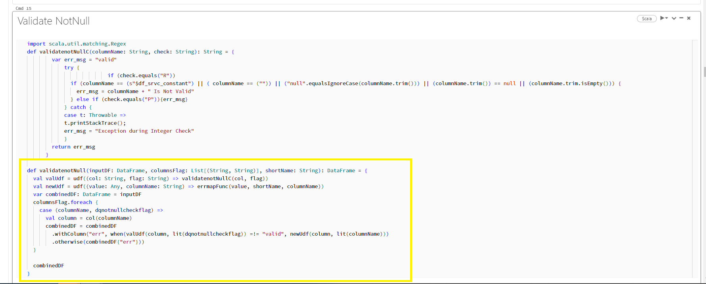

# Columnwise Data Validation

In columnar validation of data, data validation is done, taking one column at a time unlike row wise validation, where data validation is done taking one row at a time.

## New code introduced for column wise validation

## Implementation of this code change

* To refer to a sample notebook having the code changes, see [didq_datatype_columnwise_validation](https://adb-8516392274079895.15.azuredatabricks.net/?o=8516392274079895#notebook/1768675494253062/command/1768675494253063)
* Please make the changes accordingly, commit the code and publish across all environments.

To know about the update in row wise validation code, see [Row wise validation - code update](https://developer.elanco.com/dataops/2-data-ingestion-and-data-quality/5-releases/didq-2-1-0/datatypeserviceupgrade)
