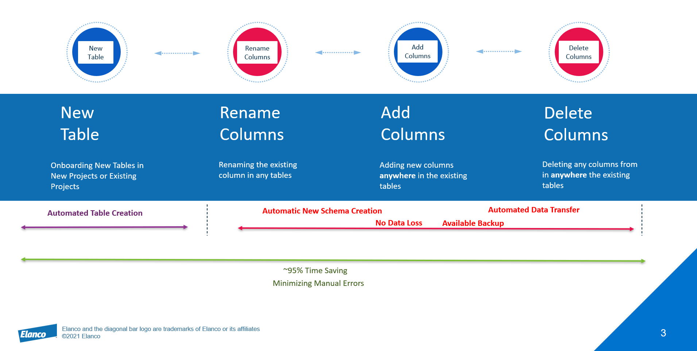

# Dynamic Schema

Dynamic schema gives us the flexibility to create new tables or make changes to existing tables with minimal time and effort. In a few simple steps, this new process will take a few minutes to complete to onboard any new table/ schema change to the system. The main aim of introducing this process is to reduce repetitive tasks, effort, and time.

## Challenges

1. Time Consuming
2. Manual Effort & Re-work
3. Error prone
4. Chances of Data loss
5. High Production Downtime

## Valuable impact

1. Time Saving
2. Easy to Congigure
3. Minimal Manual Intervention
4. Less Effort
5. Accuracy
6. Less Production Downtime

## Features

## Configurations

* Database              : ControlOps
* Configuration Table   : [DataProductSchema].ServiceCntrlMetadata

ServiceCntrlMetadata Metadata Table to configure the Tables column list for Databricks Delta table creation for **Raw**, **Stage**, **Stage Rejected**

* Database              : ControlOps
* Configuration Table   : [DataProductSchema].[CuratedToSynapseSchema]

CuratedToSynapseSchema Metadata Table to configure the Tables column list for Databricks Delta table creation for **Curated Layer** , **Synapse Tables**

* Database              : ControlOps
* Configuration Table   : [DataProductSchema].[SchemaChangeCntrl]

Newly added SchemaChangeCntrl table is to configure and log whether the table is created or not for the provided scenairos.
