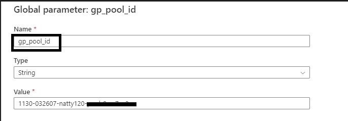

# JOB CLUSTERS

## Why Job Cluster

Currently, we are using Interactive clusters which are high in cost and used to analyze data with notebooks.
Thus, gives us much more visibility and control. This should be used in the development phase of a project.
Job Clusters are used to **run fast and robust automated jobs**.

## Why Pool

Job Clusters take an average of 4-5 Min to create, whereas when they are attached to a Pool they use the Pool’s Ideal Instance and cluster nodes get created by using the pool's ideal instances. That’s why we attach the Job cluster to Pool.

## Flow of Job Cluster


## Create Pool

* Create Pool with the best practice as keeping the **Min Idle instance as 0** and **Max Capacity as blank** so it auto scales
* Keep the **Idle instance as 60 Min** so it will terminate itself
* Instance type is **General Purpose instance type**.
  * Cluster capacity can be determined based on the needed performance and scale. Planning helps to optimize both usability and costs of running the clusters. Azure Databricks provides different cluster options based on business needs.
  * To know more on cluster optimization techniques, see [Job Cluster Optimization](https://developer.elanco.com/dataops/2-data-ingestion-and-data-quality/5-releases/didq-2-1-0/jobclusteroptimzation)
* Runtime version is latest and has **Photon preloaded runtime with Long term support**.


Create incident ticket to Dataops L2 team for Pool Creation in below link

[Click here for to create Service Now Incident](https://thespot.elanco.com/nav_to.do?uri=%2Fincident.do%3Fsys_id%3D-1%26sys_is_list%3Dtrue%26sys_target%3Dincident%26sysparm_checked_items%3D%26sysparm_fixed_query%3D%26sysparm_group_sort%3D%26sysparm_list_css%3D%26sysparm_query%3Dcaller_id%253djavascript%253ags.getUserID()%255eactive%253dtrue%255euniversal_requestISEMPTY%26sysparm_referring_url%3Dincident_list.do%253fsysparm_query%253dcaller_id%25253Djavascript%25253Ags.getUserID%252528%252529%25255Eactive%25253Dtrue%25255Euniversal_requestISEMPTY%25255EEQ%254099%2540sysparm_view%253dess%254099%2540caller_id%253djavascript%25253Ags.getUserID%252528%252529%25255Eactive%25253Dtrue%25255Euniversal_requestISEMPTY%26sysparm_target%3D%26sysparm_view%3Dess)


## Dynamic JSON Content for Linked Service

* Standard Cluster Configurations are provided to Dynamic JSON, so a cluster will be created with the provided cluster configuration.
* **Pool Id** is parameterized with **ADF global parameter**
* Cluster node is set to Memory Optimized as per best practice
* We will require to provide the **Pool Id in Global parameter**
* We need to update the **key vault** and **databricks token secret** in the dynamic json

### Cluster Configurations  

| newClusterSparkConf           	| 	Value	|
| :---        						| 	:--- 	|
| "spark.databricks.cluster.profile"          	| 	"serverless"	|
| "spark.driver.extraJavaOptions"      | 	"\"-Dlog4j2.formatMsgNoLookups=true\""	|
| "spark.databricks.delta.preview.enabled"          	| 	"true"	|
| "spark.sql.parquet.enableVectorizedReader"      | 	"false"	|
| "spark.sql.storeAssignmentPolicy"          	| 	"ANSI"	|
| "spark.executor.extraJavaOptions"      | 	"\"-Dlog4j2.formatMsgNoLookups=true\""	|
| "spark.databricks.repl.allowedLanguages"          	| 	"sql,python,r,scala"	|  


```jsonc
{
    "name": "LS_ADB_JOB_CLUSTER",
    "properties": {
        "parameters": {
            "pool_id": {
                "type": "string"
            }
        },
        "annotations": [],
        "type": "AzureDatabricks",
        "typeProperties": {
            "domain": "https://eastus.azuredatabricks.net",
            "accessToken": {
                "type": "AzureKeyVaultSecret",
                "store": {
                    "referenceName": "{KV LS name}",
                    "type": "LinkedServiceReference"
                },
                "secretName": "{Secret of Token on which Databricks should run}"
            },
            "instancePoolId": "@linkedService().pool_id",
            "newClusterNumOfWorker": "1:4",
            "newClusterSparkConf": {
                "spark.databricks.cluster.profile": "serverless",
                "spark.driver.extraJavaOptions": "\"-Dlog4j2.formatMsgNoLookups=true\"",
                "spark.databricks.delta.preview.enabled": "true",
                "spark.sql.parquet.enableVectorizedReader": "false",
                "spark.sql.storeAssignmentPolicy": "ANSI",
                "spark.executor.extraJavaOptions": "\"-Dlog4j2.formatMsgNoLookups=true\"",
                "spark.databricks.repl.allowedLanguages": "sql,python,r,scala"
            },
            "newClusterSparkEnvVars": {
                "PYSPARK_PYTHON": "/databricks/python3/bin/python3"
            },
            "newClusterVersion": "10.4.x-photon-scala2.12",
            "newClusterInitScripts": [],
            "clusterOption": "Autoscaling"
        }
    }
}
```

Create Global Parameter

* Post creation of pool, provide the pool id by creating a global parameter **gp_pool_id** in Azure data factory.



## Create Linked Service

* Post updating the dynamic JSON, update the dynamic JSON in the linked service which connects to data bricks.
* Therefore, our Linked service is created which will invoke the Job cluster attached in Pools


## Attach Libraries to Databricks Activity

We Need to add the required libraries in the data bricks activity in the Azure data factory to be installed in the cluster

| Library Type           	| 	Library Configuration	|
| :---        						| 	:--- 	|
| Wheel          	| 	dbfs:/FileStore/dataops/xlwt-1.3.0-py2.py3-none-any.whl	|
| maven      | 	com.crealytics:spark-excel_2.11:0.13.5	|
| pypi          	| 	pandas	|
| pypi      | 	pandas_schema	|


## Cost Efficient

* Currently, Our Databricks activity is using All purpose cluster which takes $0.40/DBU-hour for the standard cluster whereas the Job Cluster takes $0.15/DBU-hour for the Standard cluster.  
* All Purpose cluster will stop only after the Ideal Time whereas the Job cluster terminates once the Job is done.
* Microsoft Recommends using Job Cluster for Activity which is very cost efficient.

## Job Cluster PROS & CONS  

| PROS           	| 	CONS	|
| :---        						| 	:--- 	|
| Job clusters terminate when your job ends, reducing resource usage and cost.          	| 	Job Cluster takes 3-4 min to create whereas when attached to a Pool it will take 35-45 sec to create 	|
| Overload of activity will not happen as One job is dedicated to one Job Cluster      | 	Libraries should be attached in Databricks activity and cannot be appended Dynamically	|
| Job clusters used to run fast and robust automated jobs.           	| 	We cannot restart a Job Cluster  i.e incase of failure activity we can restart the activity, and which will create new job cluster	|

## Request for Pool creation

A request can be placed in [Service Now](https://thespot.elanco.com/nav_to.do?uri=%2Fcom.glideapp.servicecatalog_cat_item_view.do%3Fv%3D1%26sysparm_id%3D741cc8a31bf4d050f96c0dc2cd4bcbd3%26sysparm_link_parent%3D6c5b77b51b489c10f96c0dc2cd4bcb21%26sysparm_catalog%3De0d08b13c3330100c8b837659bba8fb4%26sysparm_catalog_view%3Dcatalog_default%26sysparm_view%3Dcatalog_default) for Pool creation. Under "IT Service Catalog --> Application Requests --> Enterprise Databricks Workspace Request" give the 'Type Of Request' as "Creation of Pool/ Job Cluster"

Note: Service Now developer team is working on adding this option in the list. We'll update the portal once the option is available in the request form.


