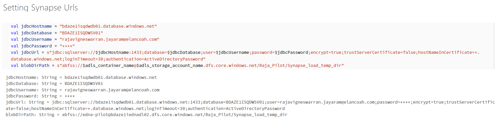
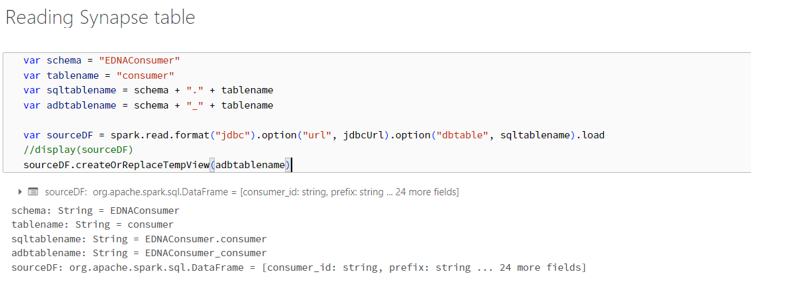
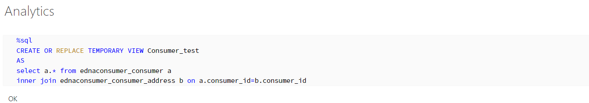
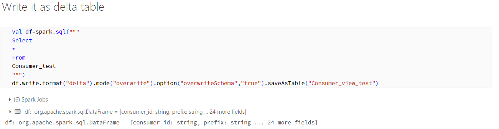
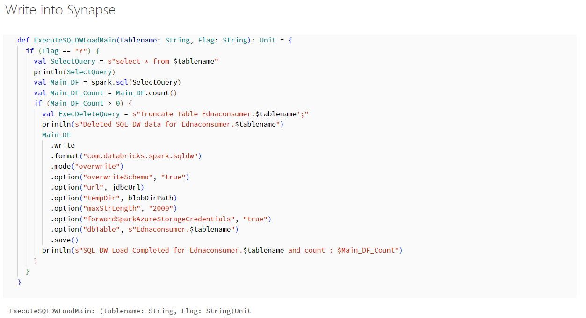
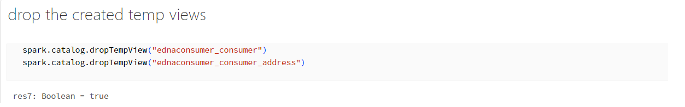

# Synapse to Databricks KPI

The intention of Synapse to Databricks KPI is to reduce the time taken and cost incurred while loading Synapse tables.
Currently, we have stored procedures defined in Synapse layer which are responsible for performing transformations and analytical operations by taking data from one/more Synapse tables and finally loading into a target syanpse table. As we have millions of records in Synapse each operation becomes time taking and costly.

To overcome this issue, we have come up with an approach where the transformation and analytics part can be shifted to Databricks which wpuld save time. Final result set can then be loaded to Synapse table directly from the databricks delta table(s). Below steps can be followed:

-	Setting Synapse Configuration

-	Reading Synapse table - It will take very minimal time to read data from Syanpse irrespective of the amount of data.

-	Perform analytics operations - Rewrite the transformation/analytics logic in databricks and write final result in one dataset.

-	Write it as delta table

-	Write into Synapse - Write the final dataset in Synapse.

-	Drop temp view & delta table (optional)

Here is an example notebook for reference - [Synapse to Databricks KPI](https://adb-8516392274079895.15.azuredatabricks.net/?o=8516392274079895#notebook/4311880607761340/command/4311880607761342)
