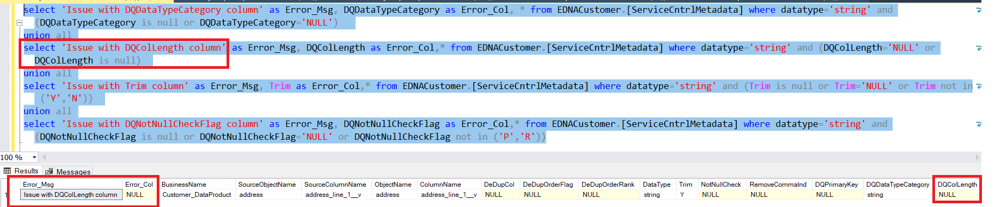
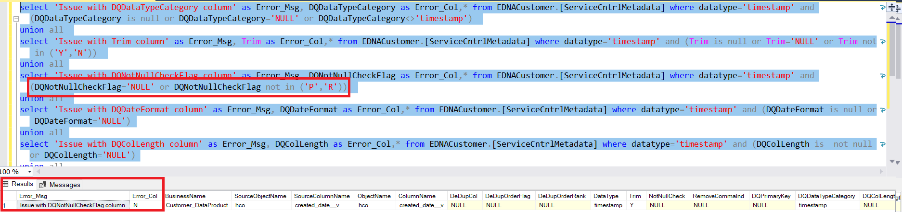
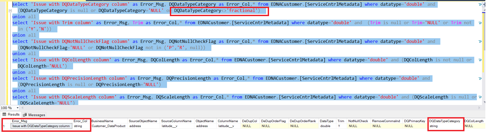
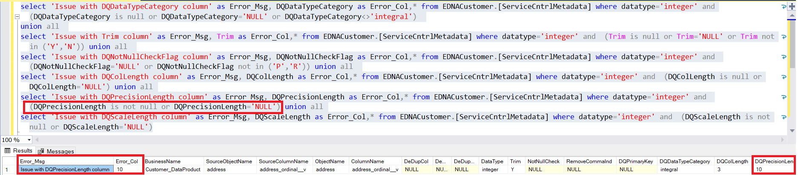
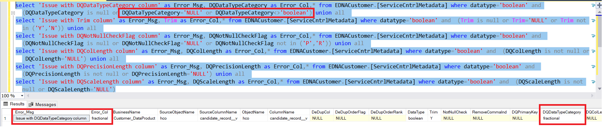
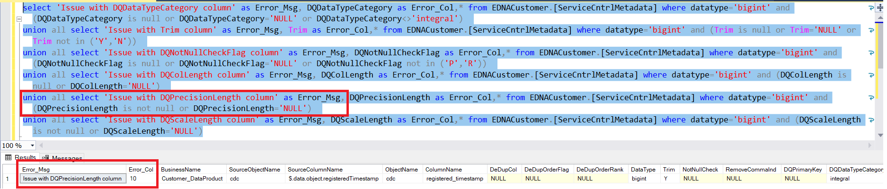

# Datatype Check

## Datatype check for string

```jsonc
select 'Issue with DQDataTypeCategory column' as Error_Msg, cast( DQDataTypeCategory  as varchar) as Error_Col, * from <DataProduct_Schema>.[ServiceCntrlMetadata] where datatype='string' and (DQDataTypeCategory is null or DQDataTypeCategory='NULL')  
union all
select 'Issue with DQColLength column' as Error_Msg, cast( DQColLength  as varchar) as Error_Col,* from <DataProduct_Schema>.[ServiceCntrlMetadata] where datatype='string' and (DQColLength='NULL' or DQColLength is null) 
union all
select 'Issue with Trim column' as Error_Msg, cast( Trim  as varchar) as Error_Col,* from <DataProduct_Schema>.[ServiceCntrlMetadata] where datatype='string' and (Trim is null or Trim='NULL' or Trim not in ('Y','N')) 
union all
select 'Issue with DQNotNullCheckFlag column' as Error_Msg, cast( DQNotNullCheckFlag  as varchar) as Error_Col,* from <DataProduct_Schema>.[ServiceCntrlMetadata] where datatype='string' and (DQNotNullCheckFlag is null or DQNotNullCheckFlag='NULL' or DQNotNullCheckFlag not in ('P','R'));
```

Mandatory services: Trim ='Y', DQColLength should not be null, DQTypeCategory <> NULL

Below is the screenshot, how the output will be displayed in case of any error records.



## Datatype check for timestamp

```jsonc
select 'Issue with DQDataTypeCategory column' as Error_Msg, cast( DQDataTypeCategory  as varchar) as Error_Col,* from <DataProduct_Schema>.[ServiceCntrlMetadata] where datatype='timestamp' and (DQDataTypeCategory is null or DQDataTypeCategory='NULL' or DQDataTypeCategory<>'timestamp') 
union all 
select 'Issue with Trim column' as Error_Msg, cast( Trim  as varchar) as Error_Col,* from <DataProduct_Schema>.[ServiceCntrlMetadata] where datatype='timestamp' and (Trim is null or Trim='NULL' or Trim not in ('Y','N')) 
union all
select 'Issue with DQNotNullCheckFlag column' as Error_Msg, cast( DQNotNullCheckFlag  as varchar) as Error_Col,* from <DataProduct_Schema>.[ServiceCntrlMetadata] where datatype='timestamp' and (DQNotNullCheckFlag='NULL' or DQNotNullCheckFlag not in ('P','R')) 
union all 
select 'Issue with DQDateFormat column' as Error_Msg, cast( DQDateFormat  as varchar) as Error_Col,* from <DataProduct_Schema>.[ServiceCntrlMetadata] where datatype='timestamp' and (DQDateFormat is null or DQDateFormat='NULL')
union all
select 'Issue with DQColLength column' as Error_Msg, cast( DQColLength  as varchar) as Error_Col,* from <DataProduct_Schema>.[ServiceCntrlMetadata] where datatype='timestamp' and (DQColLength is  not null or DQColLength='NULL') 
union all
select 'Issue with DQPrecisionLength column' as Error_Msg, cast( DQPrecisionLength  as varchar) as Error_Col,* from <DataProduct_Schema>.[ServiceCntrlMetadata] where datatype='timestamp' and (DQPrecisionLength is  not null or DQPrecisionLength='NULL')
```

Below is the screenshot, how the output will be displayed in case of any error records.



## Datatype check for double

```jsonc
select 'Issue with DQDataTypeCategory column' as Error_Msg, cast( DQDataTypeCategory  as varchar) as Error_Col,* from <DataProduct_Schema>.[ServiceCntrlMetadata] where datatype='double' and (DQDataTypeCategory is null or DQDataTypeCategory='NULL' or DQDataTypeCategory<>'fractional') 
union all
select 'Issue with Trim column' as Error_Msg, cast( Trim  as varchar) as Error_Col,* from <DataProduct_Schema>.[ServiceCntrlMetadata] where datatype='double' and  (Trim is null or Trim='NULL' or Trim not in ('Y','N')) 
union all
select 'Issue with DQNotNullCheckFlag column' as Error_Msg, cast( DQNotNullCheckFlag  as varchar) as Error_Col,* from <DataProduct_Schema>.[ServiceCntrlMetadata] where datatype='double' and  (DQNotNullCheckFlag='NULL' or DQNotNullCheckFlag not in ('P','R', null)) 
union all
select 'Issue with DQColLength column' as Error_Msg, cast( DQColLength  as varchar) as Error_Col,* from <DataProduct_Schema>.[ServiceCntrlMetadata] where datatype='double' and (DQColLength is not null or DQColLength='NULL') 
union all
select 'Issue with DQPrecisionLength column' as Error_Msg, cast( DQPrecisionLength  as varchar) as Error_Col,* from <DataProduct_Schema>.[ServiceCntrlMetadata] where datatype='double' and (DQPrecisionLength is null or DQPrecisionLength='NULL') 
union all
select 'Issue with DQScaleLength column' as Error_Msg, cast( DQScaleLength  as varchar) as Error_Col,* from <DataProduct_Schema>.[ServiceCntrlMetadata] where datatype='double' and (DQScaleLength is null or DQScaleLength='NULL')
```

Below is the screenshot, how the output will be displayed in case of any error records.



### Datatype check for Integer

```jsonc
select 'Issue with DQDataTypeCategory column' as Error_Msg, cast( DQDataTypeCategory  as varchar) as Error_Col,* from <DataProduct_Schema>.[ServiceCntrlMetadata] where datatype='integer' and (DQDataTypeCategory is null or DQDataTypeCategory='NULL' or DQDataTypeCategory<>'integral') 
union all 
select 'Issue with Trim column' as Error_Msg, cast( Trim  as varchar) as Error_Col,* from <DataProduct_Schema>.[ServiceCntrlMetadata] where datatype='integer' and  (Trim is null or Trim='NULL' or Trim not in ('Y','N')) union all 
select 'Issue with DQNotNullCheckFlag column' as Error_Msg, cast( DQNotNullCheckFlag  as varchar) as Error_Col,* from <DataProduct_Schema>.[ServiceCntrlMetadata] where datatype='integer' and  (DQNotNullCheckFlag='NULL' or DQNotNullCheckFlag not in ('P','R')) union all 
select 'Issue with DQColLength column' as Error_Msg, cast( DQColLength  as varchar) as Error_Col,* from <DataProduct_Schema>.[ServiceCntrlMetadata] where datatype='integer' and  (DQColLength is null or DQColLength='NULL') union all
select 'Issue with DQPrecisionLength column' as Error_Msg, cast( DQPrecisionLength  as varchar) as Error_Col,* from <DataProduct_Schema>.[ServiceCntrlMetadata] where datatype='integer' and  (DQPrecisionLength is not null or DQPrecisionLength='NULL') union all
select 'Issue with DQScaleLength column' as Error_Msg, cast( DQScaleLength  as varchar) as Error_Col,* from <DataProduct_Schema>.[ServiceCntrlMetadata] where datatype='integer' and  (DQScaleLength is not null or DQScaleLength='NULL')
```

Below is the screenshot, how the output will be displayed in case of any error records.



## Datatype check for Boolean

```jsonc
select 'Issue with DQDataTypeCategory column' as Error_Msg, cast( DQDataTypeCategory  as varchar) as Error_Col,* from <DataProduct_Schema>.[ServiceCntrlMetadata] where datatype='boolean' and (DQDataTypeCategory is null or DQDataTypeCategory='NULL' or DQDataTypeCategory<>'boolean') union all 
select 'Issue with Trim column' as Error_Msg, cast( Trim  as varchar) as Error_Col,* from <DataProduct_Schema>.[ServiceCntrlMetadata] where datatype='boolean' and  (Trim is null or Trim='NULL' or Trim not in ('Y','N')) union all 
select 'Issue with DQNotNullCheckFlag column' as Error_Msg, cast( DQNotNullCheckFlag  as varchar) as Error_Col,* from <DataProduct_Schema>.[ServiceCntrlMetadata] where datatype='boolean' and  (DQNotNullCheckFlag is null or DQNotNullCheckFlag='NULL' or DQNotNullCheckFlag not in ('P','R')) union all 
select 'Issue with DQColLength column' as Error_Msg, cast( DQColLength  as varchar) as Error_Col,* from <DataProduct_Schema>.[ServiceCntrlMetadata] where datatype='boolean' and  (DQColLength is not null or DQColLength='NULL') union all 
select 'Issue with DQPrecisionLength column' as Error_Msg, cast( DQPrecisionLength  as varchar) as Error_Col,* from <DataProduct_Schema>.[ServiceCntrlMetadata] where datatype='boolean' and  (DQPrecisionLength is not null or DQPrecisionLength='NULL') union all 
select 'Issue with DQScaleLength column' as Error_Msg, cast( DQScaleLength  as varchar) as Error_Col,* from <DataProduct_Schema>.[ServiceCntrlMetadata] where datatype='boolean' and  (DQScaleLength is not null or DQScaleLength='NULL')
```

Below is the screenshot, how the output will be displayed in case of any error records.



## Datatype check for bigint

```jsonc
select 'Issue with DQDataTypeCategory column' as Error_Msg, cast( DQDataTypeCategory  as varchar) as Error_Col,* from <DataProduct_Schema>.[ServiceCntrlMetadata] where datatype='bigint' and (DQDataTypeCategory is null or DQDataTypeCategory='NULL' or DQDataTypeCategory<>'integral') 
union all select 'Issue with Trim column' as Error_Msg, cast( Trim  as varchar) as Error_Col,* from <DataProduct_Schema>.[ServiceCntrlMetadata] where datatype='bigint' and (Trim is null or Trim='NULL' or Trim not in ('Y','N')) 
union all select 'Issue with DQNotNullCheckFlag column' as Error_Msg, cast( DQNotNullCheckFlag  as varchar) as Error_Col,* from <DataProduct_Schema>.[ServiceCntrlMetadata] where datatype='bigint' and (DQNotNullCheckFlag is null or DQNotNullCheckFlag='NULL' or DQNotNullCheckFlag not in ('P','R')) 
union all select 'Issue with DQColLength column' as Error_Msg, cast( DQColLength  as varchar) as Error_Col,* from <DataProduct_Schema>.[ServiceCntrlMetadata] where datatype='bigint' and (DQColLength is null or DQColLength='NULL') 
union all select 'Issue with DQPrecisionLength column' as Error_Msg, cast( DQPrecisionLength  as varchar) as Error_Col,* from <DataProduct_Schema>.[ServiceCntrlMetadata] where datatype='bigint' and (DQPrecisionLength is not null or DQPrecisionLength='NULL') 
union all select 'Issue with DQScaleLength column' as Error_Msg, cast( DQScaleLength  as varchar) as Error_Col,* from <DataProduct_Schema>.[ServiceCntrlMetadata] where datatype='bigint' and (DQScaleLength is not null or DQScaleLength='NULL')
```

Below is the screenshot, how the output will be displayed in case of any error records.


