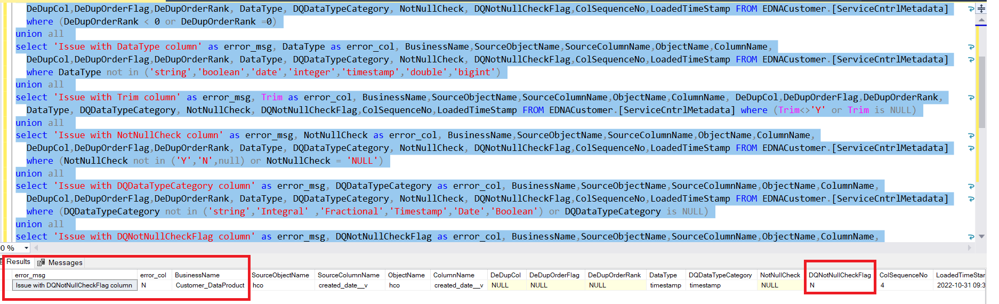

# Dedup Validation

Data deduplication process is used to eliminate multiple copies of data. Details and acceptable values can be found in [Dedup service]( https://developer.elanco.com/dataops/2-data-ingestion-and-data-quality/3-services/service-deduplication).

For running this service, below columns are mandatory:

|	Column Name	|	Acceptable Values |	Filter Condition	|
|	:---	| :---	|	:--- |
|	DeDupCol	|	'Y'	|	DeDupCol<>'Y'	|
|	DeDupOrderFlag	|	'Desc'/'Asc'|	DeDupOrderFlag  not in ('Asc','Desc')	|
|	DeDupOrderRank	|	1,2,3,...,n	|	(DeDupOrderRank < 0 or DeDupOrderRank =0)	|
|	DataType	|	Datatype of Stage Delta Table	|	DataType not in ('string','boolean','date,'integer','timestamp')	|
|	Trim	|	Y value indicates Trim Function should be applied else NULL| (Trim<>'Y' or Trim is NULL)	|
|	NotNullCheck	|	Y,N,NULL	|	(NotNullCheck not in ('Y','N') or NotNullCheck is NULL)	|
|	DQDataTypeCategory |	Integral ,Fractional,Timestamp,Date,Boolean	|	(DQDataTypeCategory not in ('Integral' ,'Fractional','Timestamp','Date','Boolean') or DQDataTypeCategory is NULL)	|
|	DQNotNullCheckFlag	|	R,P	| DQNotNullCheckFlag not in ('R','P')	|
|	ColSequenceNo	|	1,2,3....,n	| ColSequenceNo is NULL	|

```jsonc
SELECT BusinessName,SourceObjectName,SourceColumnName,ObjectName,ColumnName, DeDupCol,DeDupOrderFlag,DeDupOrderRank, DataType, DQDataTypeCategory, DQNotNullCheckFlag,ColSequenceNo,LoadedTimeStamp FROM <DataProduct_Schema>.[ServiceCntrlMetadata];
```

***Note: <DataProduct_Schema> should to be replaced by specific schema for data product in the above query.***

## Query to find error records

```jsonc
select 'Issue with DeDupCol column' as Error_Msg, cast( DeDupCol  as varchar) as Error_Col, BusinessName,SourceObjectName,SourceColumnName,ObjectName,ColumnName, DeDupCol,DeDupOrderFlag,DeDupOrderRank, DataType, DQDataTypeCategory, NotNullCheck,DQNotNullCheckFlag,ColSequenceNo,LoadedTimeStamp FROM <DataProduct_Schema>.[ServiceCntrlMetadata] where DeDupCol<>'Y'
union all 
select 'Issue with DeDupOrderFlag column' as Error_Msg, cast( DeDupOrderFlag  as varchar) as Error_Col, BusinessName,SourceObjectName,SourceColumnName,ObjectName,ColumnName, DeDupCol,DeDupOrderFlag,DeDupOrderRank, DataType, DQDataTypeCategory, NotNullCheck, DQNotNullCheckFlag,ColSequenceNo,LoadedTimeStamp FROM <DataProduct_Schema>.[ServiceCntrlMetadata] where DeDupOrderFlag not in ('Asc','Desc')
union all 
select 'Issue with DeDupOrderRank column' as Error_Msg, cast( DeDupOrderRank  as varchar) as Error_Col, BusinessName,SourceObjectName,SourceColumnName,ObjectName,ColumnName, DeDupCol,DeDupOrderFlag,DeDupOrderRank, DataType, DQDataTypeCategory, NotNullCheck, DQNotNullCheckFlag,ColSequenceNo,LoadedTimeStamp FROM <DataProduct_Schema>.[ServiceCntrlMetadata] where (DeDupOrderRank < 0 or DeDupOrderRank =0)
union all 
select 'Issue with DataType column' as Error_Msg, cast( DataType  as varchar) as Error_Col, BusinessName,SourceObjectName,SourceColumnName,ObjectName,ColumnName, DeDupCol,DeDupOrderFlag,DeDupOrderRank, DataType, DQDataTypeCategory, NotNullCheck, DQNotNullCheckFlag,ColSequenceNo,LoadedTimeStamp FROM <DataProduct_Schema>.[ServiceCntrlMetadata] where DataType not in ('string','boolean','date','integer','timestamp','double','bigint','decimal','float')
union all 
select 'Issue with Trim column' as Error_Msg, cast( Trim  as varchar) as Error_Col, BusinessName,SourceObjectName,SourceColumnName,ObjectName,ColumnName, DeDupCol,DeDupOrderFlag,DeDupOrderRank, DataType, DQDataTypeCategory, NotNullCheck, DQNotNullCheckFlag,ColSequenceNo,LoadedTimeStamp FROM <DataProduct_Schema>.[ServiceCntrlMetadata] where (Trim<>'Y' or Trim is NULL)
union all 
select 'Issue with NotNullCheck column' as Error_Msg, cast( NotNullCheck  as varchar) as Error_Col, BusinessName,SourceObjectName,SourceColumnName,ObjectName,ColumnName, DeDupCol,DeDupOrderFlag,DeDupOrderRank, DataType, DQDataTypeCategory, NotNullCheck, DQNotNullCheckFlag,ColSequenceNo,LoadedTimeStamp FROM <DataProduct_Schema>.[ServiceCntrlMetadata] where (NotNullCheck not in ('Y','N',null) or NotNullCheck = 'NULL')
union all 
select 'Issue with DQDataTypeCategory column' as Error_Msg, cast( DQDataTypeCategory  as varchar) as Error_Col, BusinessName,SourceObjectName,SourceColumnName,ObjectName,ColumnName, DeDupCol,DeDupOrderFlag,DeDupOrderRank, DataType, DQDataTypeCategory, NotNullCheck, DQNotNullCheckFlag,ColSequenceNo,LoadedTimeStamp FROM <DataProduct_Schema>.[ServiceCntrlMetadata] where (DQDataTypeCategory not in ('string','Integral' ,'Fractional','Timestamp','Date','Boolean') or DQDataTypeCategory is NULL)
union all 
select 'Issue with DQNotNullCheckFlag column' as Error_Msg, cast( DQNotNullCheckFlag  as varchar) as Error_Col, BusinessName,SourceObjectName,SourceColumnName,ObjectName,ColumnName, DeDupCol,DeDupOrderFlag,DeDupOrderRank, DataType, DQDataTypeCategory, NotNullCheck, DQNotNullCheckFlag,ColSequenceNo,LoadedTimeStamp FROM <DataProduct_Schema>.[ServiceCntrlMetadata] where (DQNotNullCheckFlag not in ('R','P') or DQNotNullCheckFlag is NULL) 
union all 
select 'Issue with ColSequenceNo column' as Error_Msg, cast( ColSequenceNo  as varchar) as Error_Col, BusinessName,SourceObjectName,SourceColumnName,ObjectName,ColumnName, DeDupCol,DeDupOrderFlag,DeDupOrderRank, DataType, DQDataTypeCategory, NotNullCheck, DQNotNullCheckFlag,ColSequenceNo,LoadedTimeStamp FROM <DataProduct_Schema>.[ServiceCntrlMetadata] where ColSequenceNo is NULL
```

## Sample entries for Dedup data

Below is an example of the output for the given query in case of any errors:


