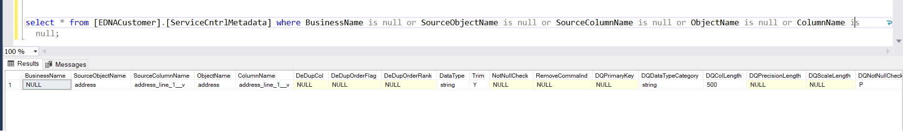

# DIDQ Audit Queries

Below are the set of queries that can be used to validate the entries in the configuration tables.

## What to expect

These queries should give 0 rows as output. If any row is coming in output, we need to correct that entry based on the correct value.There are still few cases, where these queries will not display any result but the entries are not accurate. For that there is separate set of queries defined to validate the acceptable values for each column.

```jsonc
select * from [EDNACustomer].[ServiceCntrlMetadata] where BusinessName is null or SourceObjectName is null or SourceColumnName is null or ObjectName is null or ColumnName is null;
```

**This query should give 0 records as output. In case of any error, rows will come as output.**

Here is an example, how the records will display in case of error records:



For each service specific validation, it can be done as:

- [Datatype Check Service](https://developer.elanco.com/dataops/2-data-ingestion-and-data-quality/6-didq-audit-queries/datatype-check)
- [Dedup Service](https://developer.elanco.com/dataops/2-data-ingestion-and-data-quality/6-didq-audit-queries/dedup-validation)
- [Not Null check Service](https://developer.elanco.com/dataops/2-data-ingestion-and-data-quality/6-didq-audit-queries/notnull-validation)
- [Primary Key Service](https://developer.elanco.com/dataops/2-data-ingestion-and-data-quality/6-didq-audit-queries/primary-key-validation)

***Note - We have tried to cover maximum scenarios but there can be few cases which have to be manually validated**
