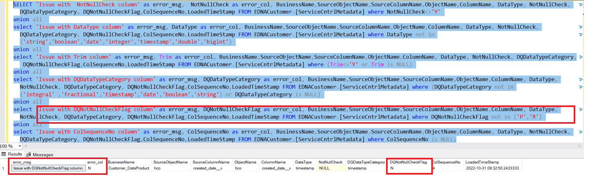

# Not Null Validation

This is specifically for the columns that should not have null values.

For running this service, below column values are mandatory:

|	Column Name	|	Acceptable Values |	Filter Condition	|
|	:---	| :---	|	:--- |
|	NotNullCheck	|	Y,N,NULL	|	NotNullCheck<>'Y'	|
|	DataType	|	Datatype of Stage Delta Table	|	DataType not in ('string','boolean','date,'integer','timestamp')	|
|	Trim	|	Y value indicates Trim Function should be applied else NULL| (Trim<>'Y' or Trim is NULL)	|
|	DQDataTypeCategory |	Integral ,Fractional,Timestamp,Date,Boolean	|	(DQDataTypeCategory not in ('Integral' ,'Fractional','Timestamp','Date','Boolean') or DQDataTypeCategory is NULL)	|
|	DQNotNullCheckFlag	|	R,P	| DQNotNullCheckFlag not in ('P')	|
|	ColSequenceNo	|	1,2,3....,n	| ColSequenceNo is NULL	|

```jsonc
SELECT BusinessName,SourceObjectName,SourceColumnName,ObjectName,ColumnName, DataType, NotNullCheck, DQDataTypeCategory, DQNotNullCheckFlag,ColSequenceNo,LoadedTimeStamp FROM <DataProduct_Schema>.[ServiceCntrlMetadata];
```

***Note: <DataProduct_Schema> should to be replaced by specific schema for data product in the above query.***

## Query to find error records

```jsonc
SELECT 'Issue with  NotNullCheck column' as Error_Msg, cast(  NotNullCheck  as varchar) as Error_Col, BusinessName,SourceObjectName,SourceColumnName,ObjectName,ColumnName, DataType, NotNullCheck, DQDataTypeCategory, DQNotNullCheckFlag,ColSequenceNo,LoadedTimeStamp FROM <DataProduct_Schema>.[ServiceCntrlMetadata] where NotNullCheck<>'Y'
union all 
select 'Issue with DataType column' as Error_Msg, cast( DataType  as varchar) as Error_Col, BusinessName,SourceObjectName,SourceColumnName,ObjectName,ColumnName, DataType, NotNullCheck, DQDataTypeCategory, DQNotNullCheckFlag,ColSequenceNo,LoadedTimeStamp FROM <DataProduct_Schema>.[ServiceCntrlMetadata] where DataType not in ('string','boolean','date','integer','timestamp','double','bigint','decimal','float')
union all 
select 'Issue with Trim column' as Error_Msg, cast( Trim  as varchar) as Error_Col, BusinessName,SourceObjectName,SourceColumnName,ObjectName,ColumnName, DataType, NotNullCheck, DQDataTypeCategory, DQNotNullCheckFlag,ColSequenceNo,LoadedTimeStamp FROM <DataProduct_Schema>.[ServiceCntrlMetadata] where (Trim<>'Y' or Trim is NULL)
union all 
select 'Issue with DQDataTypeCategory column' as Error_Msg, cast( DQDataTypeCategory  as varchar) as Error_Col, BusinessName,SourceObjectName,SourceColumnName,ObjectName,ColumnName, DataType, NotNullCheck, DQDataTypeCategory, DQNotNullCheckFlag,ColSequenceNo,LoadedTimeStamp FROM <DataProduct_Schema>.[ServiceCntrlMetadata] where (DQDataTypeCategory not in ('integral' ,'fractional','timestamp','date','boolean','string') or DQDataTypeCategory is NULL)
union all 
select 'Issue with DQNotNullCheckFlag column' as Error_Msg, cast( DQNotNullCheckFlag  as varchar) as Error_Col, BusinessName,SourceObjectName,SourceColumnName,ObjectName,ColumnName, DataType, NotNullCheck, DQDataTypeCategory, DQNotNullCheckFlag,ColSequenceNo,LoadedTimeStamp FROM <DataProduct_Schema>.[ServiceCntrlMetadata] where DQNotNullCheckFlag not in ('P','R')
union all 
select 'Issue with ColSequenceNo column' as Error_Msg, cast( ColSequenceNo  as varchar) as Error_Col, BusinessName,SourceObjectName,SourceColumnName,ObjectName,ColumnName, DataType, NotNullCheck, DQDataTypeCategory, DQNotNullCheckFlag,ColSequenceNo,LoadedTimeStamp FROM <DataProduct_Schema>.[ServiceCntrlMetadata] where ColSequenceNo is NULL;
```

## Sample entries for NotNull Data

Below is an example of the output for the given query, in case of any errors:


