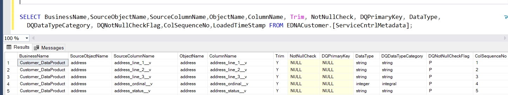
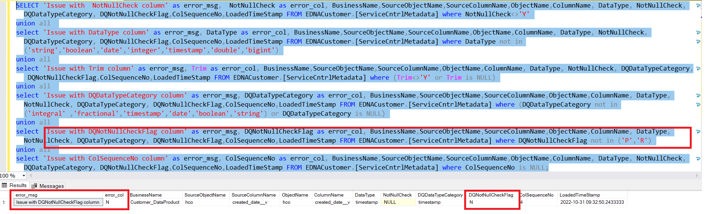

# Primary Key Validation

Primary key is the column or columns that contain values that uniquely identify each row in a table. For running this service:

Below columns are mandatory:

|	Column Name	|	Acceptable Values |	Filter Condition	|
|	:---	| :---	|	:--- |
|	DQ_PrimaryKey | Y,N,NULL	| DQ_PrimaryKey <>'N'
|	DataType	|	Datatype of Stage Delta Table	|	(DataType not in ('string','boolean','date,'integer','timestamp') or DataType is NULL)	|
|	Trim	|	Y value indicates Trim Function should be applied else NULL| (Trim<>'Y' or Trim is NULL)	|
|	NotNullCheck	|	Y,N,NULL	|	(NotNullCheck in ('Y','N') or NotNullCheck is NULL)	|
|	DQDataTypeCategory |	Integral ,Fractional,Timestamp,Date,Boolean	|	(DQDataTypeCategory not in ('Integral' ,'Fractional','Timestamp','Date','Boolean') or DQDataTypeCategory is NULL)	|
|	DQNotNullCheckFlag	|	R,P	| DQNotNullCheckFlag not in ('R','P')	|
|	ColSequenceNo	|	1,2,3....,n	| ColSequenceNo is NULL	|

***Note: DQPrecisionLength,DQScaleLength/DQColLength - These columns have to be set accordingly.Details can be found [here](https://developer.elanco.com/dataops/2-data-ingestion-and-data-quality/6-didq-audit-queries/datatype-check).***

```jsonc
SELECT BusinessName,SourceObjectName,SourceColumnName,ObjectName,ColumnName, Trim, NotNullCheck, DQPrimaryKey, DataType, DQDataTypeCategory, DQNotNullCheckFlag,ColSequenceNo,LoadedTimeStamp FROM <DataProduct_Schema>.[ServiceCntrlMetadata];
```

***Note: <DataProduct_Schema> should to be replaced by specific schema for data product in the above query.***

## Query to find Error Records

```jsonc
SELECT 'Issue with DQ_PrimaryKey column' as Error_Msg, cast( DQPrimaryKey  as varchar) as Error_Col, BusinessName,SourceObjectName,SourceColumnName,ObjectName,ColumnName, Trim, NotNullCheck, DQPrimaryKey, DataType, DQDataTypeCategory, DQNotNullCheckFlag,ColSequenceNo,LoadedTimeStamp FROM <DataProduct_Schema>.[ServiceCntrlMetadata] where (DQPrimaryKey not in ('N','Y',null) or DQPrimaryKey= 'NULL')
union all 
select 'Issue with DataType column' as Error_Msg, cast( DataType  as varchar) as Error_Col, BusinessName,SourceObjectName,SourceColumnName,ObjectName,ColumnName, Trim, NotNullCheck, DQPrimaryKey, DataType, DQDataTypeCategory, DQNotNullCheckFlag,ColSequenceNo,LoadedTimeStamp FROM <DataProduct_Schema>.[ServiceCntrlMetadata] where DataType not in ('string','boolean','date','integer','timestamp','bigint','double','decimal','float')
union all 
select 'Issue with Trim column' as Error_Msg, cast( Trim  as varchar) as Error_Col, BusinessName,SourceObjectName,SourceColumnName,ObjectName,ColumnName, Trim, NotNullCheck, DQPrimaryKey, DataType, DQDataTypeCategory, DQNotNullCheckFlag,ColSequenceNo,LoadedTimeStamp FROM <DataProduct_Schema>.[ServiceCntrlMetadata] where (Trim<>'Y' or Trim is NULL)
union all 
select 'Issue with NotNullCheck column' as Error_Msg, cast( NotNullCheck  as varchar) as Error_Col, BusinessName,SourceObjectName,SourceColumnName,ObjectName,ColumnName, Trim, NotNullCheck, DQPrimaryKey, DataType, DQDataTypeCategory, DQNotNullCheckFlag,ColSequenceNo,LoadedTimeStamp FROM <DataProduct_Schema>.[ServiceCntrlMetadata] where (NotNullCheck not in ('Y','N',null) or NotNullCheck='NULL')
union all select 'Issue with DQDataTypeCategory column' as Error_Msg, cast( DQDataTypeCategory  as varchar) as Error_Col, BusinessName,SourceObjectName,SourceColumnName,ObjectName,ColumnName, Trim, NotNullCheck, DQPrimaryKey, DataType, DQDataTypeCategory, DQNotNullCheckFlag,ColSequenceNo,LoadedTimeStamp FROM <DataProduct_Schema>.[ServiceCntrlMetadata] where (DQDataTypeCategory not in ('integral' ,'fractional','timestamp','date','boolean','string') or DQDataTypeCategory is NULL)
union all select 'Issue with DQNotNullCheckFlag column' as Error_Msg, cast( DQNotNullCheckFlag  as varchar) as Error_Col, BusinessName,SourceObjectName,SourceColumnName,ObjectName,ColumnName, Trim, NotNullCheck, DQPrimaryKey, DataType, DQDataTypeCategory, DQNotNullCheckFlag,ColSequenceNo,LoadedTimeStamp FROM <DataProduct_Schema>.[ServiceCntrlMetadata] where DQNotNullCheckFlag not in ('R','P')
union all 
select 'Issue with ColSequenceNo column' as Error_Msg, cast( ColSequenceNo  as varchar) as Error_Col, BusinessName,SourceObjectName,SourceColumnName,ObjectName,ColumnName, Trim, NotNullCheck, DQPrimaryKey, DataType, DQDataTypeCategory, DQNotNullCheckFlag,ColSequenceNo,LoadedTimeStamp FROM <DataProduct_Schema>.[ServiceCntrlMetadata] where ColSequenceNo is NULL
```

## Sample entries for Dedup data

Below is an example of the output for the given query:



Here is an example of the output for the above query in case of any error records :


