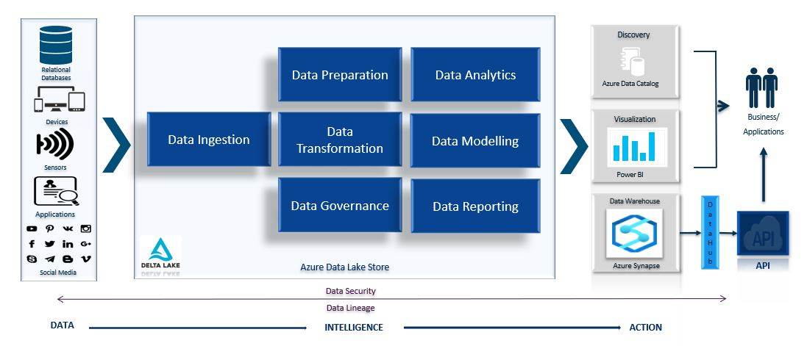
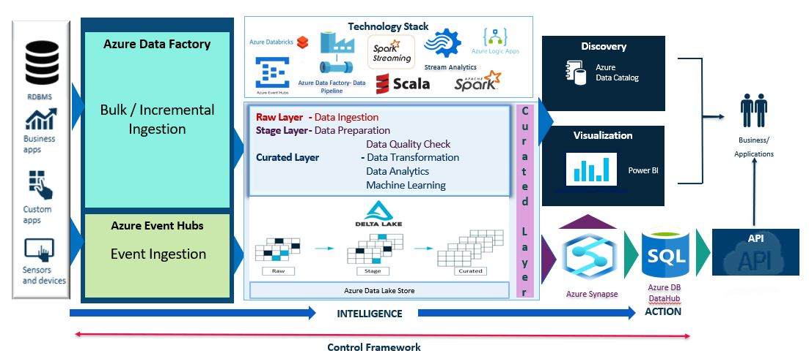

# Data Ingestion & Data Quality Framework(DIDQ)

* DIDQ is an Azure Driven Capability with Scala Code Base Framework
* Accelerator Path for Teams to Onboard Data into our Azure Platforms
* Leverages Delta Lake on Azure Data Lake Gen2
* Quick Refresh of Data on Azure Synapse and Cache (API) Layer

## Importance of Data Ingestion & Data Quality Framework(DIDQ)

* Giving Quality Controls to the Business or Project Owners
* Business Rules are easy to use
* Minimize manual work and redoing of same work
* Timespan of the Projects is reduced to ~80% - 90%
* Maximize reusability of the codes/projects and can be shared across domains/vertical teams very easily

## Data Ingestion & Data Quality Framework(DIDQ) Architecture Design

## Data Ingestion & Data Quality Framework(DIDQ) High Level Design

